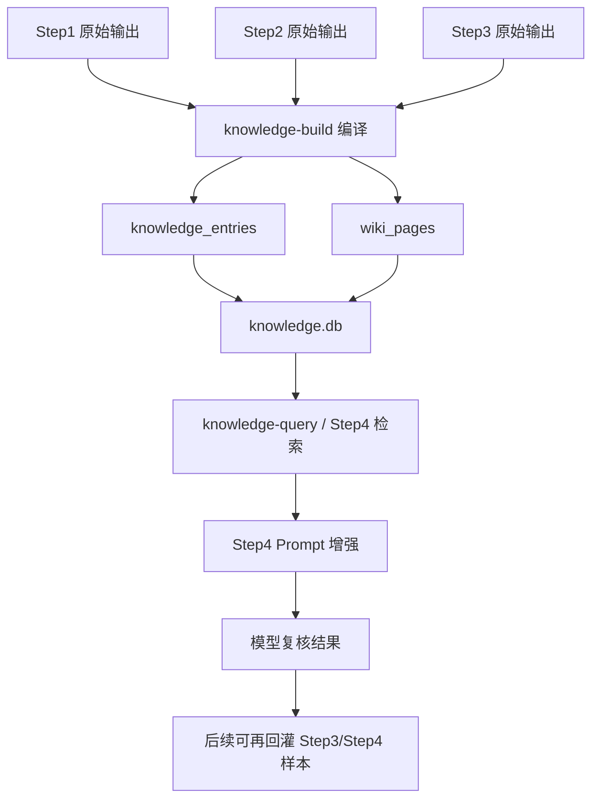

# Step4 知识库与 LLM Wiki 详细设计说明

## 1. 文档目标

这份文档回答三个核心问题：

1. 后续如何持续补充 `step1-step3` 的向量数据库
2. 当前这套“向量数据库 + LLM Wiki + Step4 提示工程”的整体运作流程是什么
3. LLM Wiki 的工作机制是什么，为什么它能比只做一次性 RAG 更适合你的场景

适用对象：

- 你自己后续持续维护这套流程
- 新接手这个项目的同事
- 未来准备把当前轻量向量实现升级成真正 embedding 服务的人

---

## 2. 先说结论

你现在这套能力，本质上不是“再造一个聊天机器人知识库”，而是在给 `Step4` 做一个长期可积累的上下文工程底座。

它有三层：

1. 原始资料层
   - 来自 `step1 / step2 / step3` 的真实输出
   - 这是唯一事实来源
2. 向量知识层
   - 把原始资料拆成知识条目 `knowledge_entries`
   - 用向量检索把“当前 Step4 行最相关的历史证据”召回出来
3. LLM Wiki 层
   - 把知识条目重新编译成更适合模型和人阅读的 wiki 页面
   - 让模型不必每次都从原始资料里重新拼装结论

所以这不是“只做向量库”，也不是“只做 wiki”，而是：

- 向量库负责“找”
- wiki 负责“组织”
- Step4 prompt 负责“用”

---

## 3. 为什么你这个场景一定要做三层

如果只做传统 RAG，会有几个问题：

1. 每次 Step4 都要从原始资料重新找章节、找规则、找历史表达式
2. 历史上已经验证过的模式不会自动沉淀
3. 同一个构件类型会反复经历“重新理解、重新判断、重新提示”
4. Prompt 很容易越堆越长，但结构仍然混乱

而你的业务天然有强复用特征：

- 同一类构件会重复出现
- 同一类项目特征表达式会重复出现
- 同一类计量单位和计算项目会重复出现
- 同一条章节规则会影响很多 Step3/Step4 行

因此最合适的办法不是只做一次检索，而是把知识逐步“编译”出来。

这正是 LLM Wiki 的价值：

- 原文证据保留在底层
- 可复用的中间知识被编译到 wiki
- Step4 每次只召回少量最相关的证据和摘要

---

## 4. 当前实现的实际结构

### 4.1 原始资料输入

知识库当前可消费三类输入：

1. `Step1`
   - `table_regions.json`
   - `catalog_summary.json`
2. `Step2`
   - `result.json` 或 `component_matching_result.json`
   - `synonym_library.json`
3. `Step3`
   - `project_component_feature_calc_matching_result.json`
   - 或兼容包含 `rows` 的结果文件

### 4.2 编译后的输出

运行 `knowledge-build` 后，会生成：

1. `knowledge.db`
   - SQLite 数据库
   - 存储知识条目和 wiki 页
2. `wiki/`
   - Markdown wiki 页面
3. `knowledge_ingest_summary.json`
   - 本次构建摘要
4. `knowledge_query_result.json`
   - 最近一次查询结果

### 4.3 数据表含义

当前数据库里有两张核心表：

1. `knowledge_entries`
   - 最底层的知识条目
   - 每条记录都对应一段可检索证据
2. `wiki_pages`
   - 编译后的 wiki 页面
   - 更适合被 Step4 prompt 或人工阅读

---

## 5. 向量数据库的整体运作流程

你可以把它理解成下面这条链路：



### 5.1 构建阶段

`knowledge-build` 做了四件事：

1. 读取 `step1-step3` 输出
2. 拆分成知识条目
3. 为每条知识条目生成向量
4. 再把知识条目按“构件 / 章节 / 历史模式”编译成 wiki 页面

### 5.2 检索阶段

当 Step4 处理一条清单行时：

1. 先把这一行整理成查询文本
2. 到知识库中找最相关的 `knowledge_entries`
3. 同时找最相关的 `wiki_pages`
4. 把结果打包成 `knowledge_context`
5. 塞进 Step4 prompt

### 5.3 推理阶段

模型拿到的不是单纯原始文本，而是四类上下文：

1. 当前本地直匹配结果
2. 当前构件的属性/计算项目摘要
3. 知识库检索出的历史证据
4. 对应的 wiki 摘要页

这样模型就能做出更稳的判断：

- 这条规则是不是在 Step1 章节说明里出现过
- 这个构件在 Step2 里是如何桥接到标准名的
- 这个构件在 Step3 历史样本里常见哪些表达式
- 当前行和历史样本是否在单位、语义、计算口径上真正一致

---

## 6. 当前“向量”到底是怎么实现的

### 6.1 当前不是 OpenAI embedding

当前实现用的是“轻量 hash embedding”。

它的特点：

- 不依赖外部 embedding API
- 不需要额外安装向量数据库
- 可本地直接跑
- 适合当前阶段先把整体机制跑通

它的原理是：

1. 把文本分词
2. 对 token 做 hash
3. 映射到固定维度向量桶
4. 做归一化
5. 用余弦相似度打分

这不是最强语义检索，但很适合现在这个项目的第一阶段，因为你的数据里有大量结构化关键词：

- 项目编码
- 构件名
- 属性词
- 单位
- 章节名
- 计算代码

这些信息用轻量 hash 向量也能召回出相当多高价值上下文。

### 6.2 未来怎么升级成真正 embedding

后续如果你希望检索效果更强，可以把当前向量层升级成：

1. OpenAI Embeddings
2. 本地 embedding 模型
3. Milvus / pgvector / Qdrant / FAISS 等真正向量库

建议升级路径：

1. 保持 `knowledge_entries` / `wiki_pages` 的逻辑结构不变
2. 只替换“向量生成”和“召回排序”模块
3. 先保留当前 hash 向量作为 fallback

这样不会推翻现有工程。

---

## 7. LLM Wiki 的工作机制是什么

### 7.1 它不是原文仓库

LLM Wiki 不是拿来存原文全文的。

原文还是在 `step1-step3` 输出里。

Wiki 的职责是：

- 总结
- 编排
- 归类
- 交叉引用
- 沉淀模式

### 7.2 它像“编译后的知识中间层”

可以把它类比成代码编译：

- `step1-step3` 原始输出 = 源代码
- `wiki` = 编译后的中间表示
- `step4 prompt` = 运行时加载的上下文

Step4 不需要每次重新读完所有源代码，只需要：

1. 先看 wiki 判断知识结构
2. 再看召回到的原始证据细节

### 7.3 当前 wiki 自动生成哪些页面

当前实现会生成四类页面：

1. `overview`
   - 整个知识库的总览
2. `component wiki`
   - 某个构件类型的知识页
   - 汇总这个构件相关的 Step2、Step3、Step1 线索
3. `chapter wiki`
   - 某个章节的聚合页
   - 便于理解章节对构件和规则的影响
4. `pattern wiki`
   - 历史表达式模式页
   - 特别适合 Step4 学习“同类清单行过去怎么写表达式、怎么选计算代码”

### 7.4 为什么 wiki 能提升 Step4 效果

因为 Step4 不是开放问答，而是“受约束的结构化修正任务”。

模型最怕的是：

- 看到一堆原始证据，但不知道哪段更重要
- 历史样本很多，但没有归纳
- 章节规则和历史结果彼此分散

Wiki 正好在这里起作用：

- 把“分散证据”先整理成结构化摘要
- 让模型先理解知识地图，再看局部细节
- 降低 prompt 中无关文本的比例

---

## 8. 后续如何补充你的 Step1-Step3 向量数据库

这是你最关心的部分。

### 8.1 最简单也是最推荐的方式

每次你完成一轮新的 `step1-step3` 结果后，重新执行一次：

```bash
python3 -m pipeline_v2 knowledge-build \
  --step1-source <新的step1输出目录> \
  --step2-source <新的step2输出目录> \
  --step3-result <新的step3结果目录或json> \
  --output-dir data/output/knowledge/step4_context
```

这会重建当前知识库。

当前实现默认是“重建式编译”，不是“数据库内增量 append”。

这样做的优点：

- 简单
- 不容易积累脏数据
- 不容易把旧版本错误知识永久残留在库里

对于你现在的规模，这通常是最稳的方式。

### 8.2 什么时候需要补充

建议在以下时机补一次：

1. 新跑完一套新的 `Step1`
   - 章节结构或 OCR 结果变了
2. 新跑完一套新的 `Step2`
   - 构件映射或同义词桥接更新了
3. 新跑完一套新的 `Step3`
   - 历史表达式和计算代码样本变多了
4. 你手工修订了关键结果
   - 尤其是想把人工复核后的高质量样本纳入知识库时

### 8.3 你应该优先补什么

如果只能优先补一部分，我建议顺序是：

1. `Step3`
   - 对 Step4 最直接有帮助
   - 因为它最接近最终任务
2. `Step1`
   - 提供章节规则依据
   - 对修正 `reasoning` 和 `match_basis` 很重要
3. `Step2`
   - 提供构件桥接和标准名语义
   - 对构件归属稳定性很重要

### 8.4 如何补“人工高质量样本”

未来最值得做的增强，不是盲目多喂原文，而是补“人工确认后的高质量样本”。

你可以新增一类输入，例如：

- `data/output/step4_reviewed/*.json`

字段建议至少包含：

- `project_code`
- `project_name`
- `component_type`
- `feature_expression_items`
- `calculation_item_code`
- `measurement_unit`
- `review_status=confirmed`
- `review_notes`

然后在 `knowledge-build` 中新增 `step4_review` entry 类型，把它纳入知识库。

这样后面的 Step4 就能优先参考“人工确认过”的历史模式。

### 8.5 不建议直接补什么

不建议把以下内容无脑灌进知识库：

1. 低质量、未复核、明显冲突的临时结果
2. 只有最终结论、没有原始上下文的样本
3. 纯聊天记录
4. 已经过时的旧规则但没有版本标记

原因很简单：

- 知识库不是越大越好
- 对 Step4 来说，错误知识的危害比缺一点知识更大

---

## 9. 建议你采用的维护流程

建议固定成下面这条流程：

### 日常生产流程

1. 跑 `Step1`
2. 跑 `Step2`
3. 跑 `Step3`
4. 跑 `knowledge-build`
5. 跑 `Step4`
6. 人工抽查 Step4 结果

### 周期性优化流程

1. 汇总人工确认的优质 Step4 结果
2. 回灌成新的知识输入
3. 重新 `knowledge-build`
4. 对比 Step4 新旧效果

### 出问题时的排查流程

1. 先跑 `knowledge-query`
2. 看当前查询召回了什么证据
3. 看 wiki 是否组织错了
4. 看底层 entry 是否缺失或过脏
5. 再决定是修 `Step1/2/3`，还是修 `knowledge-build` 规则

---

## 10. Step4 是怎么使用知识库的

当前 Step4 的用法是：

1. 先生成本地直匹配结果
2. 对每一行构造查询文本
3. 从知识库召回最相关的条目和 wiki 页面
4. 把它们写入 `batch_001_prompt_input.json`
5. 再拼接成 `batch_001_prompt.txt`
6. 调模型复核

所以知识库不是替代本地规则，而是增强本地规则。

优先级应始终保持为：

1. 当前行原文
2. 当前构件属性和计算项目
3. 当前单位约束
4. 本地直匹配结果
5. 知识库历史证据
6. wiki 总结

这点非常重要。

如果把知识库优先级抬得过高，就会出现：

- 模型机械照搬历史样本
- 当前行明明不同，却被错误套用旧模式

---

## 11. 知识库查询为什么要同时查 entry 和 wiki

因为两者解决的问题不同。

### 查 entry

解决的是：

- 当前行最相关的具体证据是哪几条
- 有哪些章节原文、历史匹配、同义词桥接能直接支撑判断

### 查 wiki

解决的是：

- 当前构件的知识结构是什么
- 这个构件在历史上常见什么表达式模式
- 当前问题大概率属于哪个知识簇

所以可以理解为：

- entry = 证据
- wiki = 脑图

模型两者都需要。

---

## 12. 你的知识库后续最值得增强的方向

### 12.1 增强方向一：引入真实 embedding

适合时机：

- 数据量更大
- 构件名和章节名的表述变得更复杂
- 你希望召回跨表述的语义相近内容

### 12.2 增强方向二：加入版本与时间

建议未来每条知识增加：

- `version`
- `source_run_id`
- `generated_at`
- `review_status`

这样可以避免旧知识污染新知识。

### 12.3 增强方向三：引入 Step4 人工确认样本

这是最实用的增强。

因为它最直接影响最终效果。

### 12.4 增强方向四：做“构件级增量重建”

当前是整库重建。

未来可以升级成：

- 只重建发生变化的构件页
- 只更新受影响的知识条目

但这一步不急，等数据量明显增大再做。

---

## 13. 推荐目录组织

建议长期固定成下面这种结构：

```text
data/
  output/
    step1/
    step2/
    step3/
    step4/
    knowledge/
      step4_context/
        knowledge.db
        knowledge_ingest_summary.json
        knowledge_query_result.json
        wiki/
          overview.md
          components/
          chapters/
          patterns/
```

如果以后按标准文档分项目维护，也可以改成：

```text
data/output/knowledge/<standard_name>/
```

这样不同标准不会互相污染。

---

## 14. 推荐命令清单

### 14.1 重建知识库

```bash
python3 -m pipeline_v2 knowledge-build \
  --step1-source data/output/step1/<run_id> \
  --step2-source data/output/step2/<run_id> \
  --step3-result data/output/step3/<run_id> \
  --output-dir data/output/knowledge/step4_context
```

### 14.2 测试某个构件查询

```bash
python3 -m pipeline_v2 knowledge-query \
  --knowledge-base data/output/knowledge/step4_context \
  --component-type 砼墙 \
  --query "钢筋混凝土墙 墙厚 体积 计算规则"
```

### 14.3 Step4 接入知识库

```bash
python3 -m pipeline_v2 step4-direct-match \
  --items-file data/input/sample_step4_items.json \
  --component-type 砼墙 \
  --components data/input/components.json \
  --synonym-library data/output/step2/<run_id>/synonym_library.json \
  --knowledge-base data/output/knowledge/step4_context \
  --config pipeline_v2/step4_runtime_config.ini
```

---

## 15. 常见问题

### Q1：我是不是每次都要重建知识库？

建议是，至少每次 `step1-step3` 结果发生明显变化时重建一次。

当前实现重建成本不高，换来的好处是结果更干净、更可控。

### Q2：Step4 会不会被历史知识“带偏”？

有这个风险，所以当前 prompt 已经明确限制：

- 历史知识只能做补充
- 当前原文、当前构件属性、当前单位约束优先级更高

### Q3：wiki 和向量库重复吗？

不重复。

- 向量库解决“找什么”
- wiki 解决“怎么组织”

### Q4：为什么不用一个纯向量库就结束？

因为你的任务不是开放问答，而是带结构约束的业务修正。

在这种场景里，组织良好的知识中间层通常比单纯相似度召回更重要。

### Q5：当前 hash 向量够用吗？

第一阶段够用。

尤其你的文本里有很多强结构化词项。

等你开始处理更复杂、更隐式的语义关系时，再升级 embedding。

---

## 16. 最后给你的实操建议

如果你想把这套东西真正用起来，而不是停在“有了一个功能”，建议按下面的节奏走：

1. 先固定一个主知识库目录
   - 例如 `data/output/knowledge/step4_context`
2. 每次 `Step3` 产出更新后，顺手重建一次知识库
3. Step4 默认都挂上 `--knowledge-base`
4. 出现误判时，先用 `knowledge-query` 看召回是否合理
5. 把人工确认过的高质量 Step4 结果作为下一阶段增强重点

一句话总结：

你的长期目标不是“让模型临时看更多资料”，而是“让模型逐步拥有一套可持续维护、可逐步积累、可结构化复用的工程知识底座”。

